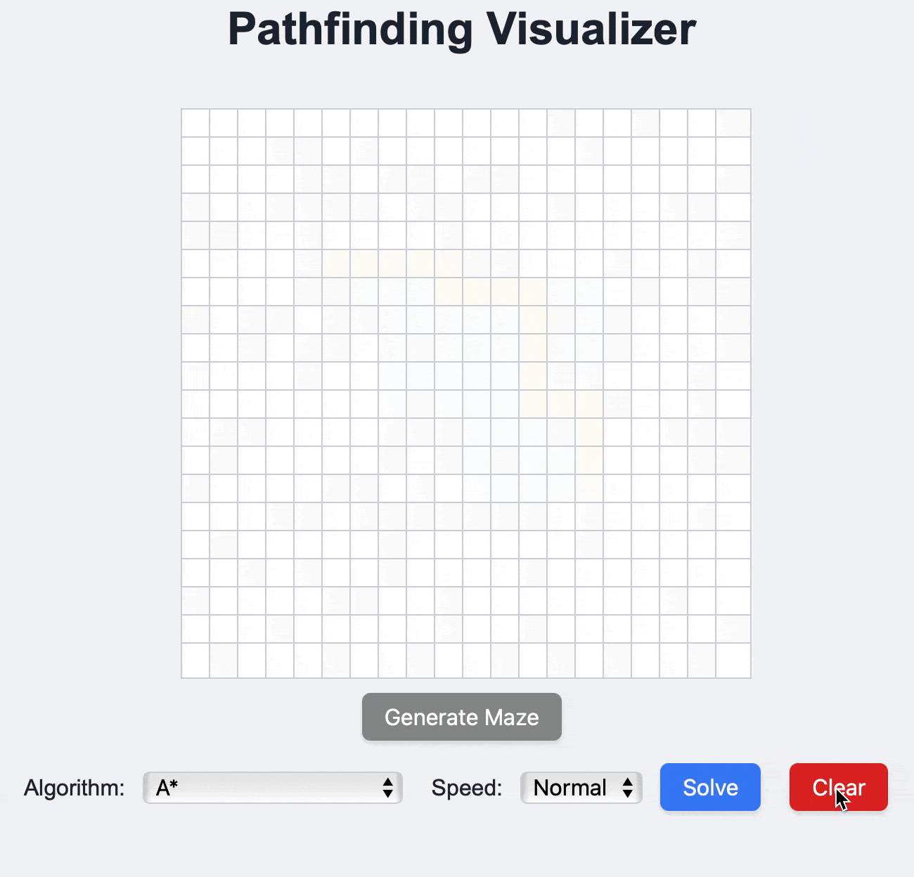

# Pathfinding Visualizer

A lightweight web application to visualize pathfinding algorithms in a grid.

---

## 📌 Features

- Visual grid editor to toggle walls
- Start and end points
- Pathing algorithm server-side in Python
    - A*
    - Dijkstra
    - Breadth-First Search
    - Depth-First Search
    - Lee Algorithm
- Interactive visualization of the path

---
## Demo




---
## 🛠️ Tech Stack

- **Python** (3.8+)
- **Docker** - Container for Demo
- **Flask** – lightweight web server
- **HTML/CSS/JavaScript** – frontend grid UI
- **uv** – fast Python dependency manager

---

## 🚀 Build & Run Docker

### Build the image
```bash
docker build -t pathfinding-visualizer .
```

### Run the container

```bash
docker run -p 5050:5050 pathfinding-visualizer
```
### Access the App
`http://127.0.0.1:5050`

## ⚡ Setup Instructions

### 1️⃣ Clone the repository

```bash
git clone https://github.com/yourusername/pathfinding-visualizer.git
cd pathfinding-visualizer
```

---

### 2️⃣ Install uv

```bash
pip install uv
```

---

### 3️⃣ Install dependencies

If you are using `pyproject.toml`:

```bash
uv pip install -e .
```

Or if you prefer a requirements file:

```bash
uv pip install -r requirements.txt
```

---

### 4️⃣ Run the server

```bash
python pathing/app.py
```

---

### 5️⃣ Open in your browser

Visit:

```
http://127.0.0.1:5050/
```

---

## 📈 Design Decisions

- **Flask** was chosen for simplicity and clarity.
- **uv** was selected for reproducible and fast dependency installs.
- **A* implementation** is minimal and well-commented to highlight understanding.
- **Frontend grid visualization** is interactive and built with vanilla JavaScript.
- The project is modular: you can easily extend it with other pathfinding algorithms.

---

## 📝 License

This project is open-source and available under the GPL-3 License.

---

✅ **This project is intended as a portfolio showcase to demonstrate:**

- visualization of pathfinding logic
- Frontend and backend integration

---

